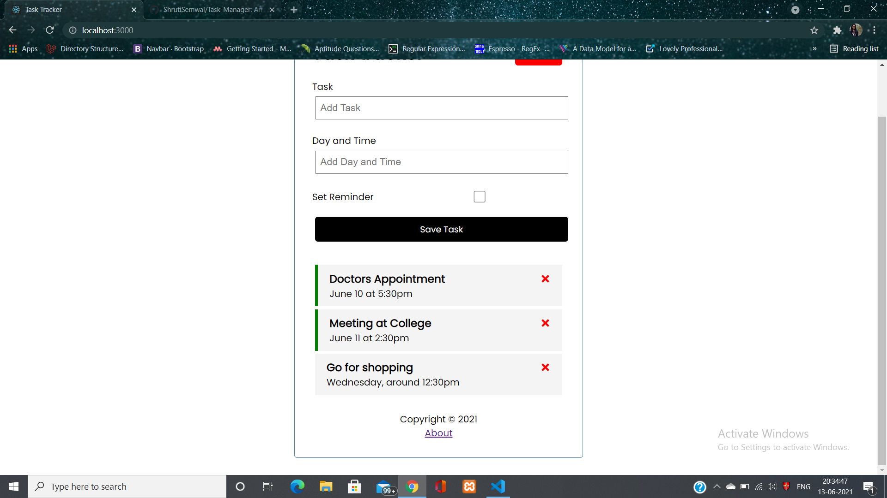

# Task Manager React App

This project was bootstrapped with [Create React App](https://github.com/facebook/create-react-app).

## Usage

Install dependencies
### `npm install`

Run React dev server: (http://localhost:3000)
### `npm start`

Run JSON server: (http://localhost:5000)
### `npm run server`

## Main

## Adding a Task

## Deleting a Task

## Removing Reminder (Green Bar)

## About app

